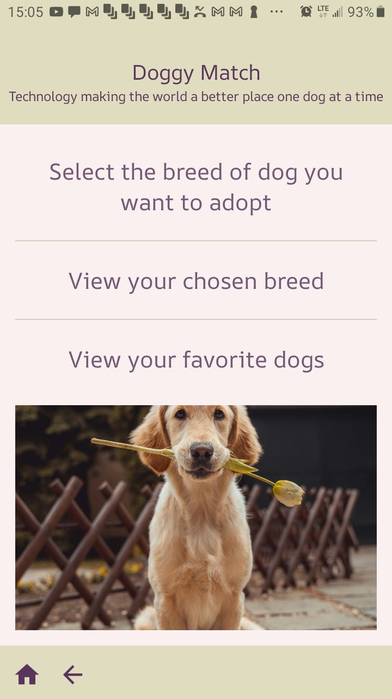
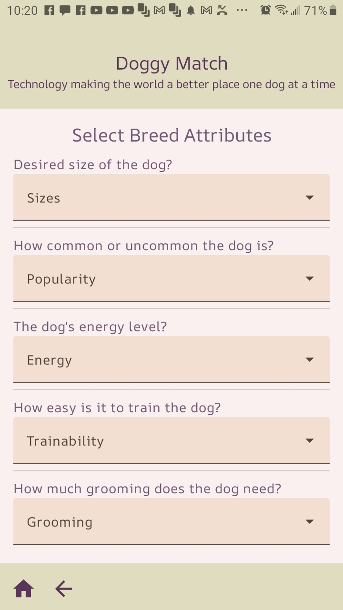
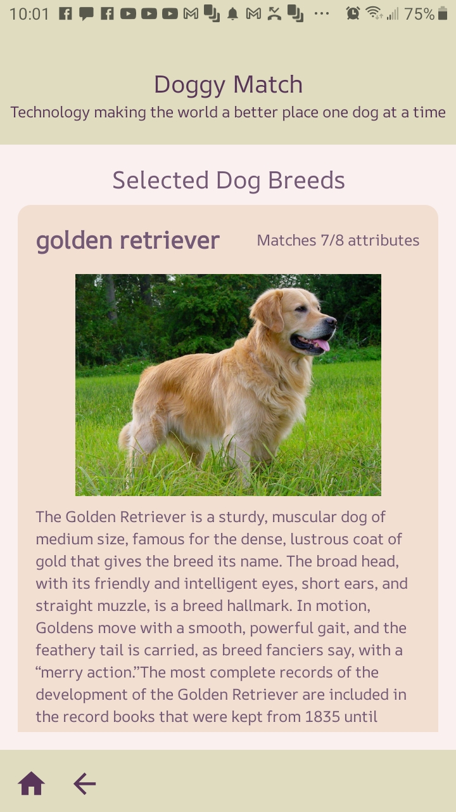
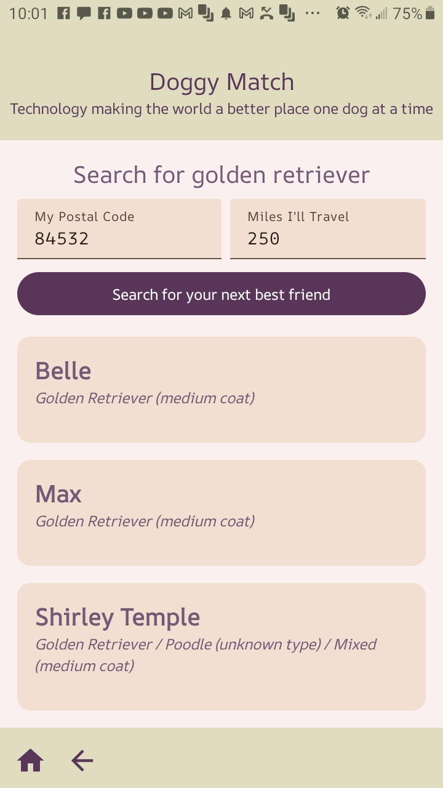
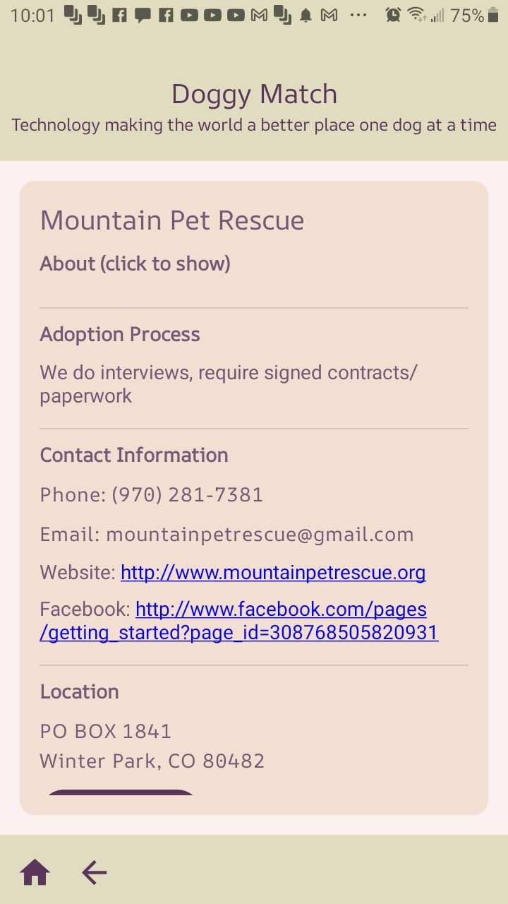
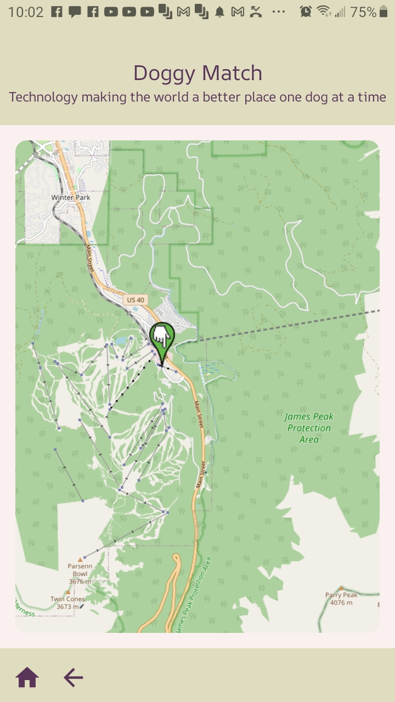

# Overview

This project is currently an MVP for an application that could conceivably be of benefit to 
homeless/rescued dogs (and by extension pets) as well as their soon owners/caretakers. It was originally done as a final project for CS3200 in the CS department at Utah State Univ. 

The app 
allows the user to find which breed may be most compatible with their lifestyle and household, 
learn about different breeds, and to also interface with a nation-wide network of shelters and 
rescue organizations, possibly finding their next best friend. They are able to find shelters and 
rescue organizations within a radius of their home, and search for adoptable animals in them, by 
chosen breed and/or generally. They can view information about the organization offering a dog, by which they can reach the 
hosting organizations and use that information to investigate how they may make their new friend. This includes a map of the organization's location.

Beyond this current course project/MVP, this is a project that could be expanded upon to become a 
truly humanitarian product.

## Screenshots

Here are some screenshots of the application:

<table>
  <tr>
    <td></td>
    <td>&nbsp;<td>
    <td></td>
    <td>&nbsp;<td>
    <td></td>
  </tr>
  <tr><td>&nbsp;<td></tr>
  <tr>
    <td></td>
    <td>&nbsp;<td>
    <td></td>
    <td>&nbsp;<td>
    <td></td>
  </tr>
</table>

# Data Sources

The internal database contains prepopulated tables for breed information. One contains the breed 
“selectors,” which are the different attributes (e.g., friendliness or groom frequency) by 68 breeds, 
the other descriptions, image URLs, and breed ids, of each breed. 

These were assembled using the notebooks in the "ETL notebooks" directory. Raw breed data is in the "data" directory.

These attributes have already 
been merged from four data sources:

- Dog Breed Details dataset: https://www.kaggle.com/datasets/warcoder/dog-breeds-details 
- The akcdata dataset: https://tmfilho.github.io/akcdata/ 
- Image urls for breeds from the Dog API: https://www.thedogapi.com/ 
- Breed IDs for searches via the Rescue Groups API: 
https://rescuegroups.org/services/adoptable-pet-data-api/

## Rescue Group API

Currently available for adoptable dogs is from the **Rescue Groups Adoptable Pet Data API**:

https://rescuegroups.org/services/adoptable-pet-data-api/

In order for the app to be able to make searches from their API, an API key is required. It may be obtained from them:

https://rescuegroups.org/services/request-an-api-key/

The key then has to be added to the local.properties file in the Android project (once it is imported to Android Studio). The line to add will be:

```
RESCUE_API_KEY=<your API key>
```

# Future

There is positive potential for this project. Some of the possible directions may include:

- Improving breed selection criteria, adding breeds. (Current app covers 65 breeds.)
- Additional search modalities, such as listing rescue organizations in one's area and searching on criteria other than breed. 
- Additional platforms to include iOS and Web.
- Additional API or other database searches for available adoptees.
